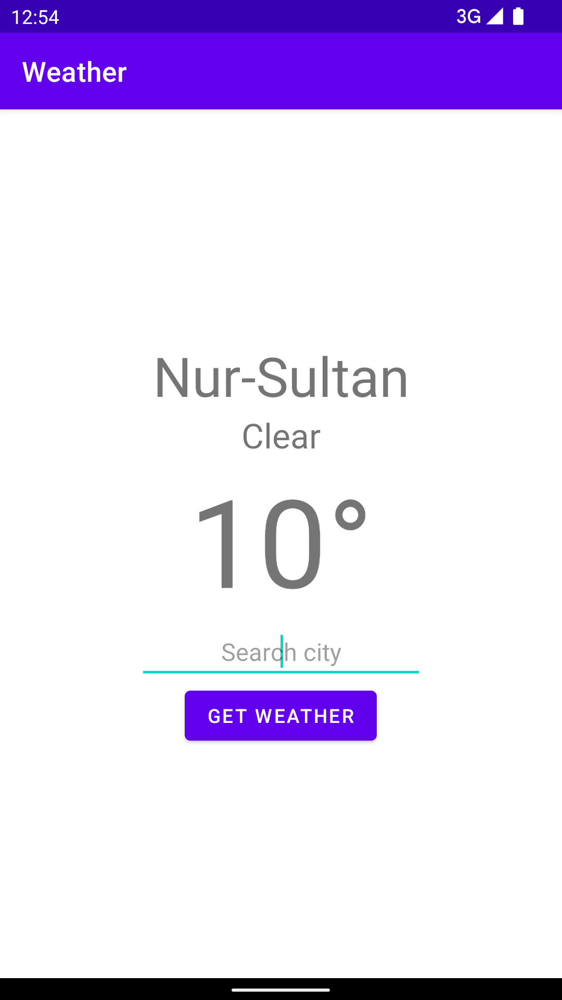
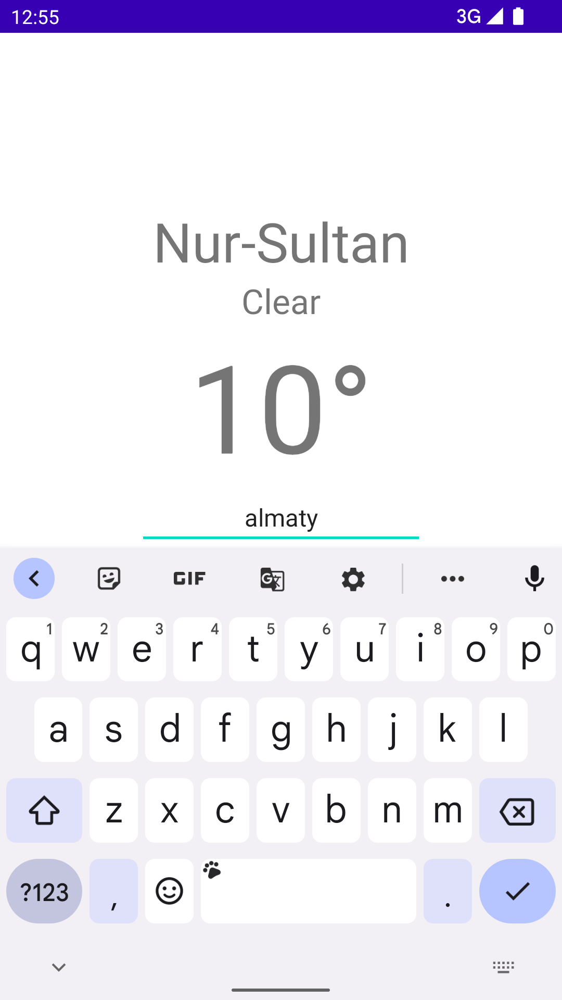
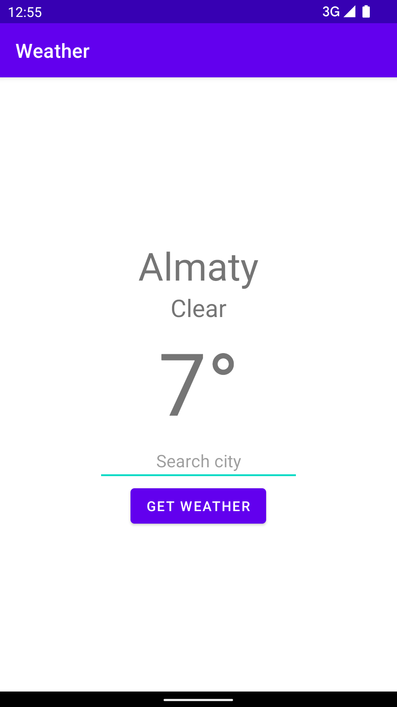

# Assignment 5 - Connection to internet

## Weather app

- Group: SE 2017
- Students:
  - Aruzhan Uskembaeva
  - Naziya Baisakalova

Used [OpenWeatherApi](https://openweathermap.org/api), Moshi, Retrofit

Base URL `https://api.openweathermap.org/data/2.5/weather`

Query params

| Param | Value                |
| ----- | -------------------- |
| q     | City name            |
| appid | API key              |
| units | Units of measurement |

### Example request

Method **GET**

> https://api.openweathermap.org/data/2.5/weather?q=Almaty&appid=33bb1ed92538bdebe147ed23fdff735d&units=metric

Response

```json
{
  "coord": {
    "lon": 76.95,
    "lat": 43.25
  },
  "weather": [
    {
      "id": 800,
      "main": "Clear",
      "description": "clear sky",
      "icon": "01n"
    }
  ],
  "base": "stations",
  "main": {
    "temp": 12.09,
    "feels_like": 10.24,
    "temp_min": 12.09,
    "temp_max": 12.09,
    "pressure": 1022,
    "humidity": 34,
    "sea_level": 1022,
    "grnd_level": 925
  },
  "visibility": 10000,
  "wind": {
    "speed": 3.15,
    "deg": 161,
    "gust": 2.37
  },
  "clouds": {
    "all": 0
  },
  "dt": 1651172686,
  "sys": {
    "country": "KZ",
    "sunrise": 1651189727,
    "sunset": 1651240210
  },
  "timezone": 21600,
  "id": 1526384,
  "name": "Almaty",
  "cod": 200
}
```

# Screenshot 1



# Screenshot 2



# Screenshot 3


